<!--
  Profile README for github.com/pushpjeetcholkar
  - Banner:          assets/banner.svg (hand-made, edit the text inside the file)
  - Stats and snake: generated daily into /profile by .github/workflows/profile.yml
-->

<p align="center">
  <a href="https://www.pushpjeet.com">
    
  </a>
</p>

<p align="center">
  <a href="https://www.pushpjeet.com"><b>pushpjeet.com</b></a> &nbsp;·&nbsp;
  <a href="https://www.linkedin.com/in/pushpjeet-cholkar/">LinkedIn</a> &nbsp;·&nbsp;
  <a href="https://www.instagram.com/coachpushpjeet/">Instagram</a> &nbsp;·&nbsp;
  <a href="https://www.pitcsolutions.com">PITC Solutions</a> &nbsp;·&nbsp;
  <a href="mailto:pc@pitcsolutions.com">pc@pitcsolutions.com</a>
</p>

## 🗄️ Ask the database

```sql
SELECT *
  FROM people
 WHERE name = 'Pushpjeet Cholkar'
   AND loves IN ('data', 'cloud', 'teaching', 'chess');
```

| Column | Value |
|:--|:--|
| `ROLE` | Cloud and AI/ML consultant, corporate trainer, researcher |
| `COMPANY` | Founder of [PITC Solutions](https://www.pitcsolutions.com), working from Houston, USA and Indore, India |
| `EXPERIENCE` | 17 years in engineering, 300+ corporate trainings delivered |
| `JOURNEY` | Oracle 8i → 23ai → AWS → Terraform → machine learning → RAG and LLMs |
| `CERTIFIED` | AWS Solutions Architect – Associate · OCI Foundations Associate · OCP 11g DBA · OCP Developer (9i, 10g, 11g) |
| `TEACHING` | University faculty and bootcamp instructor |
| `RESEARCH` | LLM tutoring systems, learning analytics, chess game analysis |
| `OPEN_TO` | Consulting, corporate training, research collaboration |

<sub>1 row selected.</sub>

## 🧱 One stack, three layers

I started in databases, moved up into the cloud, and now build AI on top of both.

**Data**

<p>
  
  
  
  
  
</p>

**Cloud and DevOps**

<p>
  
  
  
  
  
  
  
  
  
</p>

**AI / ML**

<p>
  
  
  
  
  
  
  
  
  
</p>

## 📚 Learn with me, free

I teach for a living, and a lot of what I teach lives in these repos. If you are starting out, this order works well.

| # | Track | Start here | What's inside |
|:-:|:--|:--|:--|
| 1 | SQL | [oracle_sql](https://github.com/pushpjeetcholkar/oracle_sql) | Oracle SQL Complete Guide: 18 chapters, from the first `SELECT` to hierarchical queries and regular expressions |
| 2 | Git | [git-step-by-step](https://github.com/pushpjeetcholkar/git-step-by-step) | Git from the very basics, one step at a time |
| 3 | Python | [python](https://github.com/pushpjeetcholkar/python) | The Python code and examples I use in class |
| 4 | Data engineering | [project-data-engineer](https://github.com/pushpjeetcholkar/project-data-engineer) | A roadmap to becoming a data engineer, with course content and guidance |
| 5 | Infrastructure as code | [terraform-bootcamp](https://github.com/pushpjeetcholkar/terraform-bootcamp) | Terraform, hands-on |
| 6 | Containers | [kubernetes](https://github.com/pushpjeetcholkar/kubernetes) | Scripts for learning Kubernetes |
| 7 | CI/CD | [CICD_Example](https://github.com/pushpjeetcholkar/CICD_Example) | A simple CI/CD pipeline, end to end |
| 8 | Machine learning | [machinelearning](https://github.com/pushpjeetcholkar/machinelearning) | ML datasets, labs and notes |

More tutorials and labs at [pushpjeet.com](https://www.pushpjeet.com).

## 🔬 Research

I study how AI can help people learn, and I like using my own data to do it.

- **LLM tutoring systems.** Retrieval-augmented (RAG) tutors that stay grounded in the course material.
- **Learning analytics.** Measuring what actually helps a learner, informed by 300+ trainings.
- **Chess × machine learning.** My own [lichess](https://lichess.org/@/pushpjeet) games, about 13,000 of them, as a dataset for studying how a self-taught player improves.

Papers in progress, on the way to a PhD. Co-authors and collaborators are welcome.

<!-- Publications: add each paper here as "Title. Venue, Year. [link]" once it is out. -->

## 🛠️ Also built

- [milk-parlour-app](https://github.com/pushpjeetcholkar/milk-parlour-app): a Flutter Android app for milk collection and invoice management at a local dairy
- [myaichatbot](https://github.com/pushpjeetcholkar/myaichatbot): an AI chatbot in Python

## 📊 GitHub activity

<p align="center">
  <picture>
    <source media="(prefers-color-scheme: dark)" srcset="https://raw.githubusercontent.com/pushpjeetcholkar/pushpjeetcholkar/main/profile/stats-dark.svg">
    <source media="(prefers-color-scheme: light)" srcset="https://raw.githubusercontent.com/pushpjeetcholkar/pushpjeetcholkar/main/profile/stats-light.svg">
    
  </picture>
  <picture>
    <source media="(prefers-color-scheme: dark)" srcset="https://raw.githubusercontent.com/pushpjeetcholkar/pushpjeetcholkar/main/profile/langs-dark.svg">
    <source media="(prefers-color-scheme: light)" srcset="https://raw.githubusercontent.com/pushpjeetcholkar/pushpjeetcholkar/main/profile/langs-light.svg">
    
  </picture>
</p>

<p align="center">
  <picture>
    <source media="(prefers-color-scheme: dark)" srcset="https://raw.githubusercontent.com/pushpjeetcholkar/pushpjeetcholkar/main/profile/snake-dark.svg">
    <source media="(prefers-color-scheme: light)" srcset="https://raw.githubusercontent.com/pushpjeetcholkar/pushpjeetcholkar/main/profile/snake-light.svg">
    
  </picture>
</p>

## 🤝 Work with me

| Corporate training | Consulting | Research |
|:--|:--|:--|
| Oracle, AWS, Terraform, Linux and AI/ML programs for engineering teams, delivered worldwide. | Database, cloud and AI/ML work through PITC Solutions, contracted from the USA or India. | Co-authoring and collaboration on LLM tutoring, learning analytics and game analytics. |

Start a conversation at [pc@pitcsolutions.com](mailto:pc@pitcsolutions.com) or through [pushpjeet.com](https://www.pushpjeet.com).

<p align="center">
  <sub><i>Get the Most, from the Best!!</i> &nbsp;·&nbsp; <a href="https://www.pitcsolutions.com">PITC Solutions</a></sub>
</p>
